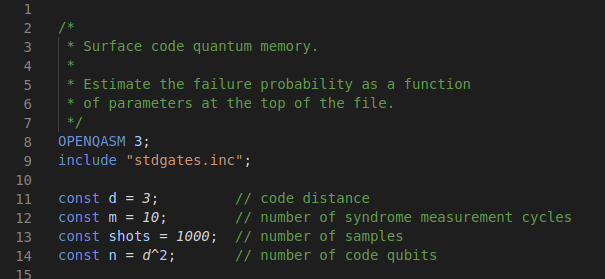
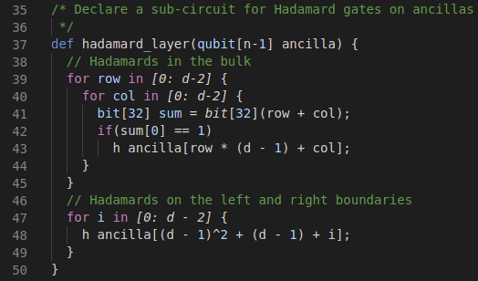

# OpenQASM Language Support

This extension provides VSCode, Eclipse, and Theia IDE's support for the OpenQASM language

## Features

* Syntax-Highlighting
* Multi-line Comments
* Advanced Loop Styling

## Requirements

If you have any requirements or dependencies, add a section describing those and how to install and configure them.

## Extension Settings

This extension contributes the following settings:

* `languages.qasm`
* `grammars.qasm`

## Known Issues

## Release Notes

### 0.0.1

Initial release implementing basic syntax and styling